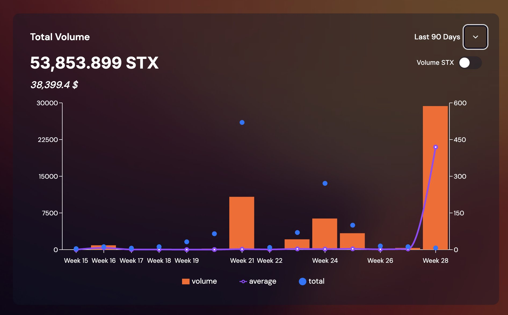
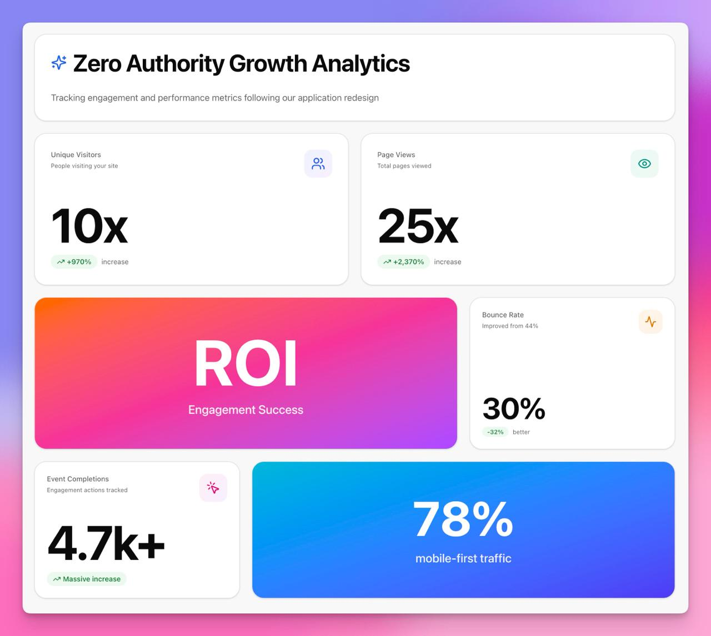

# SIP-31 Interim Grant: Design-Driven Development for Stacks

**By Exponent Labs LLC**

📄 **[Read the Full Grant Submission →](sip-31-interim-grant-ddd.md)**

## Executive Thesis

When Rocky redesigned Zero Authority's user experience, transaction volume surged. When he redesigned BNS One (Bitcoin Name Service), new wallet creation accelerated and platform adoption followed. The pattern is clear: **exceptional design drives measurable business results**.

Now, as Stacks targets $1B TVL and positions itself as the leading Bitcoin L2, the ecosystem faces a critical bottleneck—not in smart contract infrastructure, but in **design talent**. While Nakamoto, sBTC, and Clarity 4 provide world-class backend capabilities, builders lack the UI/UX resources needed to compete with top-tier ecosystems and capture mainstream adoption.

This grant addresses the gap strategically: **Rocky will train a new generation of UI/UX designers through hands-on mentorship on 8 high-impact Stacks applications**. Each week, designer mentees will conduct experience design audits and create professional redesigns alongside Rocky, learning the skills that generated his proven track record. The critical output isn't just 8 improved applications—it's a self-sustaining design community that continues elevating the entire ecosystem.

**The opportunity**: Industry standard shows $100 return for every $1 invested in design. Rocky has already demonstrated this ROI twice. This grant creates a multiplier effect by **minting new UI/UX designers** who can replicate that success across dozens of Stacks projects, supporting builders as they prepare for TGEs, pursue exchange listings, and scale toward millions of users.

**The thesis**: As the leading Bitcoin L2 accelerates toward its roadmap goals, design excellence becomes infrastructure. This grant doesn't just improve UX—it builds the **human capital required for ecosystem sustainability**, positioning Stacks as the premier destination where design excellence and Bitcoin innovation meet.

### Zero Authority Growth Analytics

*Rocky's UI/UX redesign for Zero Authority delivered exceptional measurable results: 10x visitor growth, 25x page view increase, and 32% bounce rate improvement.*

---

## The Problem

Stacks excels at backend smart contract development but lacks UI/UX focus. The ecosystem needs design excellence to drive adoption and maximize the value of its Bitcoin Layer-2 infrastructure.

> "You win or lose based on your user experience."

## The Solution

Rocky, the designer behind Zero Authority and BNS One, will **train and mentor a new generation of UI/UX designers** through hands-on experience design audits and redesigns of 8 top Stacks applications.

**The Critical Output**: A cohort of trained UI/UX experience designers who can continue elevating Stacks ecosystem design standards.

**Proven track record**: Rocky's designs for Zero Authority and BNS One correlated with measurable increases in transaction volume, new wallet creation, and revenue.

**Design ROI**: Industry standard is 10x return on design investment.

## Deliverables

**Primary**: Cohort of trained UI/UX designers with professional portfolio work

**Weekly Projects** (8 applications, one per week):

1. **BoostX** - Features and integrations
2. **Deorganized Media** - Content platform
3. **Velar** - Leading DEX
4. **StackingDAO** - Liquid staking protocol  
5. **Hermetica** - Bitcoin-backed stablecoin
6. **Boom Wallet** - Stacks wallet
7. **Faktory.fun** - NFT and token launchpad
8. **Skullcoin** - Community token

**Each week includes**:
- **Design Audit** - Mentees learn to identify UX issues under Rocky's guidance
- **Experience Design Prototypes** - Mentees create multiple design variations
- **UI/UX Redesign** - High-fidelity mockups produced by mentee team
- **Live Review Session** - Mentees present work to the community
- **Implementation Guide** - Professional documentation
- **1-on-1 Mentorship** - Personal coaching sessions on design skills

## Timeline

**Duration**: 8 weeks (under 2 months)

**Schedule**: One project per week, with public review sessions streamed to the Stacks community

**Start**: Upon grant approval  
**Completion**: 8 weeks from start date

## Selection Criteria

Projects selected based on:
- **Total Value Locked (TVL)** - Highest capital deployment
- **Daily Wallet Activations** - User engagement metrics
- **Daily Transactions** - Platform activity volume

## Team

- **Rocky** - Front-end engineer and UI/UX designer (Zero Authority, BNS One)
- **Exponent Labs LLC** - Stacks ecosystem development and design

## Expected Outcomes

**Talent Development**:
- 5-10 trained UI/UX designers with real-world portfolio work
- 70%+ designer retention in Stacks ecosystem post-grant
- Formation of Stacks Design Guild for ongoing collaboration
- Self-sustaining design community that continues mentoring new designers

**Project Impact**:
- 8 Stacks applications with professional design audits and redesigns
- Reusable design patterns and components for the ecosystem
- Public design education through live review sessions
- Measurable improvements in user engagement and adoption
- 10x ROI on design investment based on industry standards

## Technologies

- Lovable - AI-powered development
- Shadcn - Component library
- Tailwind CSS - Styling framework
- Design systems and accessibility standards

---

**Contact**: Reach out through Stacks community channels for collaboration opportunities.
