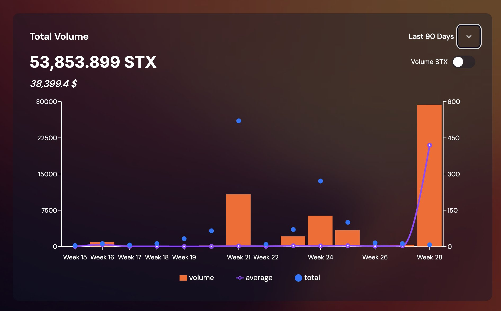

## Rocky's Proven Track Record

*Rocky's UI/UX redesign for BNS.One (Bitcoin Name Service) demonstrating measurable impact on platform success and user adoption.*

### Zero Authority DAO: Measurable Design Impact
Visit: https://zeroauthoritydao.com/

**📊 Growth Stats After Rocky's UI/UX Redesign:**
- **Unique Visitors:** ~10x increase (+~970%)
- **Page Views:** ~25x increase (+~2,370%)
- **Bounce Rate:** 32% improvement (from 44% → 30%)
- **Event Completions (Engagement ROI):** Low baseline → 4,700+ events (massive positive shift)

These metrics demonstrate the direct business impact of exceptional design work—Rocky's redesign didn't just make Zero Authority look better, it drove real user growth, engagement, and retention.

## 🙂 Applicant Information                
- **Email:** rocky@exponentlabs.ai
- **Twitter:** @rockyntheblock
- **Main project/association:** Exponent Labs LLC - Stacks ecosystem development and design
- **Notable ecosystem achievements or impact:**
  - Rocky lead the UI/UX Experience Redesign for Zero Authority, resulting in **10x visitor growth (+970%)**, **25x page view increase (+2,370%)**, **32% bounce rate improvement**, and **4,700+ event completions**
  - Rocky lead the UI/UX Experience Redesign for BNS One (Bitcoin Name Service), contributing to platform success and user adoption
  - Demonstrated track record of significant ROI on design investment across Stacks applications (industry standard: $100 return per $1 invested)
  - Demonstrated track record of leading mentees and helping them secure permanent full-time jobs in tech (Ayden, Christina, Tien, etc.)

## 📃 Grant Overview
- **Grant Name:** Design-Driven Development (DDD) for Stacks
- **Total Budget (USD, STX, or BTC):** $16,000 USD (8 projects × $2,000/project, delivered biweekly over 16 weeks)
- **Grant Goal (in one sentence):** Train and mentor a cohort of 5-8 UI/UX designers through hands-on design audits and redesigns of 8 top Stacks applications (one project every 2 weeks), building a sustainable talent pipeline while improving ecosystem UX and reaching 2,000+ community members through public education.
- **Grant Audience:** Aspiring UI/UX designers, front-end developers seeking design skills, Stacks project teams, Bitcoin builders, and the broader Stacks community
- **Grant Team:** Rocky (@rockyntheblock)

## 📊 Impact Metrics & Cost Justification

**Primary Impact: Designer Training**
- **5-8 trained UI/UX designers** with professional portfolio work (8 real projects each)
- **Cost per designer trained:** $2,000-$3,200 per designer for 16 weeks of intensive mentorship
- **Value created per designer:** Each trained designer can deliver $50k-$100k+ annual value to ecosystem (based on industry design rates of $75-150/hour)
- **ROI timeframe:** Each designer generates 15-30x return within first year through project work

**Secondary Impact: Ecosystem Reach**
- **8 Stacks project teams** receive professional design audits and implementation guides
- **2,000+ community members** reached through 8 biweekly livestreamed review sessions
- **500+ engaged viewers** attending live sessions and participating in Q&A
- **100+ developers** implementing design improvements based on audits
- **50+ builders** accessing reusable component library and design patterns

**Tertiary Impact: Long-term Ecosystem Growth**
- **Stacks Design Guild formation** creating sustainable talent pool for future projects
- **70%+ designer retention** ensuring trained designers remain active in ecosystem 6+ months
- **Self-sustaining mentorship** where trained designers mentor next cohort

**Cost Breakdown & Justification:**
- **Mentor compensation (Rocky):** $8,000 (50% of budget) - 20+ hours/week for 16 weeks (one intensive project every 2 weeks) including audit work, mentorship sessions, livestreams, and deliverable reviews
- **Mentee stipends:** $4,000 (25% of budget) - Small stipends for 5-8 mentees ($500-800 each) to enable participation
- **Tools & infrastructure:** $2,000 (12.5% of budget) - Figma licenses, design tools, hosting for component library
- **Community bounties:** $2,000 (12.5% of budget) - Implementation bounties for projects adopting designs

**Why designers are valuable:**
- Industry shows $100 return for every $1 invested in design
- Rocky's proven track record: Zero Authority and BNS One success demonstrate measurable business impact
- Design talent shortage is critical bottleneck for Stacks builders preparing for TGEs and listings
- Trained designers provide ongoing value across multiple projects (not single-use)

## 🚀 Grant Mission, Impact, Risks, and Traction

- **Grant Mission:** Empower 5-8 aspiring UI/UX designers in the Stacks ecosystem to learn professional design practices through hands-on mentorship, real-world project audits, and collaborative creation of experience design prototypes. By training designers on 8 high-impact applications driving the path to $1B TVL in DeFi, we establish a sustainable talent pipeline that elevates design as a first-class discipline alongside smart contract development. As the leading Bitcoin L2 focuses on DeFi growth, user experience is table stakes—this grant ensures the ecosystem has the human capital needed for long-term sustainability and builder success.

- **Grant Impact:** The critical output is a cohort of 5-8 trained UI/UX designers equipped with real-world experience on 8 major Stacks applications (BoostX, Deorganized Media, Velar, StackingDAO, Hermetica, Boom Wallet, Faktory.fun, and Skullcoin). Each designer will work alongside Rocky in a mentorship model, learning to conduct audits, create prototypes, and deliver professional redesigns. Beyond the core cohort, the grant reaches 2,000+ community members through livestreamed sessions and provides professional design resources to 8 project teams. As Stacks accelerates toward its $1B TVL milestone and positions itself as the fastest Bitcoin L2 with superior user experience and low-cost transactions, design excellence becomes critical infrastructure. This acts as a design-powered social layer that strengthens the leading Bitcoin L2 by attracting and retaining design-driven community members, ensuring builders have the resources needed as adoption scales.

- **Grant Risks:** 
  - **Risk:** Designer mentees may lack foundational skills. **Mitigation:** Screen candidates for basic design understanding (portfolio review + skills assessment), provide beginner-friendly guides, and offer 1-on-1 mentorship sessions tailored to skill level. One interested participant is currently in school studying UI/UX Design.
  - **Risk:** Low retention of trained designers post-grant (target: 70%+). **Mitigation:** Build community through biweekly livestreams, create ongoing paid opportunities through project partnerships, establish Stacks Design Guild with recurring projects, and track retention via 3-month and 6-month check-ins.
  - **Risk:** Quality dilution with multiple designers producing work. **Mitigation:** Rocky reviews all deliverables before publication, provides multiple feedback loops per project, establishes quality rubric for audits/prototypes, and maintains high bar demonstrated in Zero Authority and BNS One work.
  - **Risk:** Low community engagement in livestreams. **Mitigation:** Partner with project teams to promote sessions, offer bounties for participation, record and publish for async viewing, and leverage existing Stacks community channels for distribution.

- **Traction:**
  - **Zero Authority:** Rocky's UI/UX redesign delivered exceptional measurable results:
    - **10x increase in unique visitors** (+~970%)
    - **25x increase in page views** (+~2,370%)
    - **32% bounce rate improvement** (44% → 30%)
    - **4,700+ event completions** (from low baseline to massive engagement)
    - Increases in transaction volume, new wallet creation, and revenue generation
  - **BNS One:** Design improvements led to strong user adoption and platform success, demonstrating ROI on design investment
  - **Existing demand:** 3+ designers already interested in participating based on informal outreach
  - **Project interest:** Multiple projects (BoostX, Deorganized Media, Velar) already confirmed interest in receiving design audits
  - **Ecosystem demand:** As Stacks focuses on DeFi growth and targets $250mm TVL by end of Q2 2025, the ecosystem lacks comprehensive UI/UX training despite strong backend infrastructure with Nakamoto, sBTC, and Clarity 4 upgrades
  - **Builder needs:** Stacks builders with listable tokens and growing protocols need professional design support to compete as the ecosystem scales and attracts millions of users
  - **Proven ROI:** Industry standard shows $100 return for every $1 invested in design—critical for value accrual as adoption accelerates
  - **Alignment with roadmap:** This grant complements ongoing ecosystem growth initiatives including SIP-031 Interim Grant program, Stacks Ascent, and DeFi growth plans

## 🛣️ Grant Roadmap & Deliverables

**Duration:** 16 weeks (4 months)

**Schedule:** One project every 2 weeks to allow for thorough mentorship and high-quality deliverables

**Primary Deliverable:** Cohort of 5-8 trained UI/UX experience designers equipped to elevate Stacks ecosystem design standards.

**Biweekly Deliverables (8 complete packages):**

Each 2-week cycle focuses on one application with designer mentees working alongside Rocky:

1. **Design Audit Report** - Mentees learn to identify UX issues, friction points, accessibility gaps, and user flow problems through hands-on analysis
2. **Experience Design Prototypes** - Mentees collaboratively create multiple design variations and prototypes under Rocky's guidance
3. **UI/UX Redesign** - High-fidelity mockups with complete design system (colors, typography, components, spacing) produced by mentee team
4. **Live Review Session** - Public walkthrough streamed to the Stacks community where mentees present their work and receive feedback
5. **Implementation Guide** - Component specifications, front-end recommendations, and technical documentation
6. **Mentorship Sessions** - 1-on-1 classes and design critiques helping mentees develop professional skills

## 📈 Milestones: Impact-Focused

**Milestone 1 - Week 4 Complete (End of Week 4)**
**Amount:** $4,000 (25% of budget)

**Impact Metrics:**
- ✅ **5-8 designers onboarded** with confirmed participation and skill assessments completed
- ✅ **2 projects audited** (BoostX, Deorganized Media) with professional design audit reports
- ✅ **2 sets of redesign mockups** delivered to project teams
- ✅ **400+ community members reached** through 2 livestreamed review sessions
- ✅ **100+ engaged viewers** participating in live Q&A and feedback
- ✅ **2 implementation guides** published for ecosystem reference

**Deliverables:**
- Weeks 1-2: BoostX audit + redesign + live session + mentorship
- Weeks 3-4: Deorganized Media audit + redesign + live session + mentorship

---

**Milestone 2 - Week 8 Complete (End of Week 8)**
**Amount:** $4,000 (25% of budget)

**Impact Metrics:**
- ✅ **4 projects audited** (cumulative) with actionable UX improvements identified
- ✅ **4 project teams** receiving implementation guidance
- ✅ **800+ community members reached** (cumulative) through livestreams
- ✅ **200+ engaged viewers** (cumulative) learning design practices
- ✅ **5-8 designers showing skill progression** (measured via portfolio quality assessment)
- ✅ **2 projects beginning implementation** of design recommendations

**Deliverables:**
- Weeks 5-6: Velar audit + redesign + live session + mentorship (DeFi UX focus)
- Weeks 7-8: StackingDAO audit + redesign + live session + mentorship

---

**Milestone 3 - Week 12 Complete (End of Week 12)**
**Amount:** $4,000 (25% of budget)

**Impact Metrics:**
- ✅ **6 projects audited** (cumulative) driving ecosystem-wide UX improvements
- ✅ **1,200+ community members reached** (cumulative)
- ✅ **300+ engaged viewers** (cumulative)
- ✅ **Component library published** with reusable design patterns from 6 projects
- ✅ **50+ developers** accessing component library and design system docs
- ✅ **3+ projects implementing** design recommendations (50% implementation target tracking)
- ✅ **5-8 designers** with 6 professional projects in portfolio (job-ready threshold)

**Deliverables:**
- Weeks 9-10: Hermetica audit + redesign + live session + mentorship (Financial UX)
- Weeks 11-12: Boom Wallet audit + redesign + live session + mentorship (Wallet UX)

---

**Milestone 4 - Week 16 Complete (Grant Completion)**
**Amount:** $4,000 (25% of budget)

**Impact Metrics:**
- ✅ **8 projects audited** with complete design audit packages delivered
- ✅ **8 project teams** equipped with implementation-ready designs
- ✅ **2,000+ community members reached** through all livestreams
- ✅ **500+ engaged viewers** (cumulative) educated on design practices
- ✅ **5-8 designers certified** with 8 professional projects each (64 total projects)
- ✅ **Stacks Design Guild formed** with recurring meeting schedule and project pipeline
- ✅ **4+ projects implementing** design recommendations (50% target achieved)
- ✅ **100+ developers** using component library and design patterns
- ✅ **Measurable UX improvements** in at least 2 projects (engagement metrics tracked)

**Deliverables:**
- Weeks 13-14: Faktory.fun audit + redesign + live session + mentorship
- Weeks 15-16: Skullcoin audit + redesign + live session + mentorship
- Final: Component library published, Design Guild established, impact report completed

**Long-term Tracking (Post-Grant):**
- **3-month check-in:** Designer retention rate, projects implementing designs, new projects taking designs
- **6-month check-in:** Designer employment/freelance status, ecosystem impact measurements, Design Guild sustainability

---

## 📋 Project Scope

| Weeks | Project | Type | Mentorship Focus | Strategic Focus | Expected Reach |
|-------|---------|------|------------------|-----------------|----------------|
| 1-2 | BoostX | Features & integrations | Audit methodology | Fast, consistent user flows that compete with top ecosystems | 200+ viewers |
| 3-4 | Deorganized Media | Content platform | Prototyping techniques | User engagement patterns for Web3 content platforms | 200+ viewers |
| 5-6 | Velar | Leading DEX | DeFi UX patterns | Low-cost transaction flows & liquidity interfaces for DeFi TVL growth | 300+ viewers |
| 7-8 | StackingDAO | Liquid staking protocol | Staking interface design | Simplified stacking experience & Bitcoin yield | 250+ viewers |
| 9-10 | Hermetica | Bitcoin-backed stablecoin (USDh) | Financial app UX | Stablecoin liquidity flows critical for Stacks DeFi growth | 250+ viewers |
| 11-12 | Boom Wallet | Stacks wallet | Wallet UX & security design | Wallet integrations & onboarding flows for millions of new users | 300+ viewers |
| 13-14 | Faktory.fun | NFT & token launchpad | NFT marketplace design | Token launch UX supporting builders' TGE readiness | 250+ viewers |
| 15-16 | Skullcoin | Community token | Community-driven design | Community engagement patterns for ecosystem network effects | 250+ viewers |

**Alternative candidates:** STXTools and other high-impact Stacks applications may be considered based on project availability and community input.

---

## 🛠️ Technology Stack
- Lovable - AI-powered development platform
- Shadcn - Component library
- Tailwind CSS - Styling framework
- Figma/Design tools for high-fidelity mockups
- Design systems and accessibility standards (WCAG)

## 📊 Success Metrics

**Primary (Talent Development):**
- ✅ **5-8 trained UI/UX designers** with professional 8-project portfolios (vs. goal: 5-8)
- ✅ **100% mentee completion rate** (all enrolled designers complete 16 weeks)
- ✅ **70%+ designer retention** in Stacks ecosystem 6 months post-grant
- ✅ **Stacks Design Guild formed** with recurring meetings and project pipeline
- ✅ **3+ trained designers** securing paid work within 3 months

**Secondary (Project Deliverables):**
- ✅ **8 complete design audit packages** delivered on schedule (1 every 2 weeks)
- ✅ **8 project teams** equipped with implementation guides
- ✅ **50%+ implementation rate** (4+ projects implementing designs within 6 months)
- ✅ **Reusable component library** with patterns from all 8 projects

**Tertiary (Community Impact):**
- ✅ **2,000+ community members reached** through 8 livestreamed sessions
- ✅ **500+ engaged viewers** attending live sessions and Q&A
- ✅ **100+ developers** using component library and design patterns
- ✅ **8 public education sessions** teaching design best practices
- ✅ **Measurable UX improvements** in implementing projects (tracked via engagement metrics)

**Long-term Impact:**
- ✅ **Self-sustaining design community** continues mentoring new designers as ecosystem scales
- ✅ **Trained designers take freelance/full-time roles** with Stacks builders and protocols
- ✅ **Design-driven development becomes standard practice**, supporting healthy Stacks DeFi and builder growth
- ✅ **Stacks Design Guild serves as talent pool** for projects seeking UI/UX expertise as they prepare for TGEs and listings
- ✅ **Position Stacks as premier destination** for designers in the leading Bitcoin L2, attracting design talent alongside DeFi capital
- ✅ **Ecosystem growth from ground up** through human capital investment, ensuring the leading Bitcoin L2 has design infrastructure needed for long-term sustainability and value accrual
- ✅ **Support builders with design resources** as Stacks achieves roadmap goals: $1B TVL, millions of users, and fastest Bitcoin L2 performance

---

