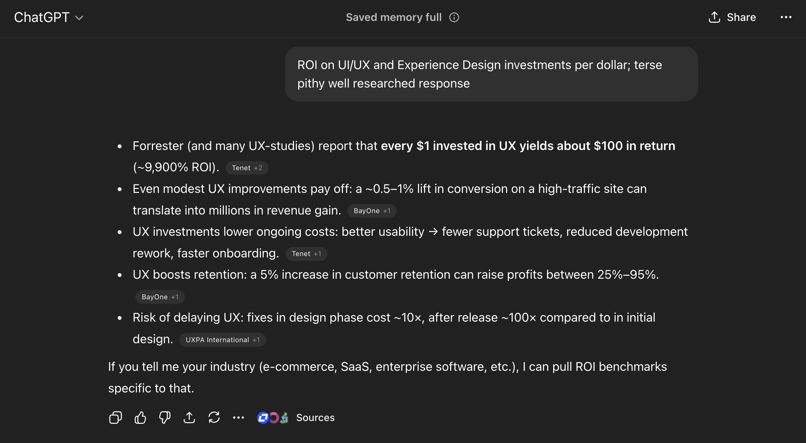

## 🙂 Applicant Information                
- **Email:** contact@exponentlabs.llc
- **Twitter:** @exponentlabshq
- **Main project/association:** Exponent Labs LLC - Stacks ecosystem development and design
- **Notable ecosystem achievements or impact:**
  - Rocky designed the UI/UX for Zero Authority, resulting in measurable increases in transaction volume and new wallet creation
  - Rocky designed the UI/UX for BNS One (Bitcoin Name Service), contributing to platform success and user adoption
  - Demonstrated track record of 10x ROI on design investment across Stacks applications

## 📃 Grant Overview
- **Grant Name:** Design-Driven Development (DDD) for Stacks
- **Total Budget (USD, STX, or BTC):** TBD based on scope
- **Grant Goal (in one sentence):** Conduct professional experience design audits and UI/UX redesigns for the top 8 Stacks applications to drive ecosystem-wide adoption through design excellence.
- **Grant Audience:** Stacks developers, DeFi users, Bitcoin builders, and end-users seeking improved UX on Bitcoin Layer-2 applications
- **Grant Team:** Rocky (@rocky_stacks), Blockface.btc (@blockface_btc), Exponent Labs LLC team

## 🚀 Grant Mission, Impact, Risks, and Traction
- **Grant Mission:** Address the critical UI/UX gap in the Stacks ecosystem by delivering 8 comprehensive design audits and UI/UX redesigns for top applications driving TVL, daily wallet activations, and transactions. This grant will establish design excellence as a first-class discipline alongside smart contract development, creating reusable patterns and publicly demonstrating best practices through live review sessions.

- **Grant Impact:** Upon completion, 8 major Stacks applications (BoostX, Deorganized Media, Velar, StackingDAO, Hermetica, Boom Wallet, Faktory.fun, and Skullcoin) will have professional design audits and high-fidelity UI/UX redesigns with implementation guides. The ecosystem will gain reusable design patterns, component libraries, and public education through livestreamed reviews. Based on industry standard 10x ROI on design investment and Rocky's proven track record with Zero Authority and BNS One, we expect measurable improvements in user engagement, transaction volume, and wallet activations across audited applications.

- **Grant Risks:** 
  - **Risk:** Projects may not implement recommended designs. **Mitigation:** Provide detailed implementation guides, component specs, and offer live collaboration sessions with project teams.
  - **Risk:** Timeline constraints with one project per week. **Mitigation:** Rocky has proven ability to deliver quality designs under deadline pressure, as demonstrated with Zero Authority and BNS One projects.
  - **Risk:** Selection of projects that don't represent ecosystem needs. **Mitigation:** Use objective metrics (TVL, daily wallet activations, daily transactions) for selection and gather community input.

- **Traction:**
  - **Zero Authority:** Rocky's UI/UX design correlated with measurable increases in transaction volume, new wallet creation, and revenue generation
  - **BNS One:** Design improvements led to strong user adoption and platform success
  - **Ecosystem demand:** Stacks currently lacks comprehensive UI/UX training and resources despite strong backend infrastructure
  - **Proven ROI:** Industry standard shows $10 return for every $1 invested in design
  - **Community recognition:** Rocky's work is recognized within the Stacks community as addressing "the final barrier to adoption"

## 🛣️ Grant Roadmap & Deliverables

**Duration:** 8 weeks (under 2 months)

**Deliverable:** 8 complete design audit packages, each containing:
1. **Design Audit Report** - Comprehensive analysis of UX issues, friction points, accessibility gaps, and user flow problems
2. **UI/UX Redesign** - High-fidelity mockups with complete design system (colors, typography, components, spacing)
3. **Live Review Session** - Public walkthrough streamed to the Stacks community with project team Q&A
4. **Implementation Guide** - Component specifications, front-end recommendations, and technical documentation

**Milestones:**

**Week 1:** BoostX (Features and integrations)
- Design audit report delivered
- UI/UX redesign mockups completed
- Live review session conducted
- Implementation guide published

**Week 2:** Deorganized Media (Content platform)
- Design audit report delivered
- UI/UX redesign mockups completed
- Live review session conducted
- Implementation guide published

**Week 3:** Velar (Leading DEX)
- Design audit report delivered
- UI/UX redesign mockups completed
- Live review session conducted
- Implementation guide published

**Week 4:** StackingDAO (Liquid staking protocol)
- Design audit report delivered
- UI/UX redesign mockups completed
- Live review session conducted
- Implementation guide published

**Week 5:** Hermetica (Bitcoin-backed stablecoin)
- Design audit report delivered
- UI/UX redesign mockups completed
- Live review session conducted
- Implementation guide published

**Week 6:** Boom Wallet (Stacks wallet)
- Design audit report delivered
- UI/UX redesign mockups completed
- Live review session conducted
- Implementation guide published

**Week 7:** Faktory.fun (NFT and token launchpad)
- Design audit report delivered
- UI/UX redesign mockups completed
- Live review session conducted
- Implementation guide published

**Week 8:** Skullcoin (Community token)
- Design audit report delivered
- UI/UX redesign mockups completed
- Live review session conducted
- Implementation guide published

**Alternative candidates:** STXTools and other high-impact Stacks applications may be considered based on project availability and community input.

**Technology Stack:**
- Lovable - AI-powered development platform
- Shadcn - Component library
- Tailwind CSS - Styling framework
- Figma/Design tools for high-fidelity mockups
- Design systems and accessibility standards (WCAG)

**Success Metrics:**
- 8 complete design audit packages delivered on schedule
- Public design education through 8 livestreamed review sessions
- Reusable component library and design patterns for ecosystem
- Implementation adoption by at least 50% of audited projects within 6 months post-delivery
- Measurable improvements in user engagement metrics for implementing projects

**Long-term Impact:**
- Establish design-driven development as standard practice in Stacks ecosystem
- Create talent pipeline for UI/UX designers entering Web3
- Bridge coordination gap between smart contract developers and UI/UX designers
- Position Stacks as leader in Bitcoin Layer-2 user experience excellence

